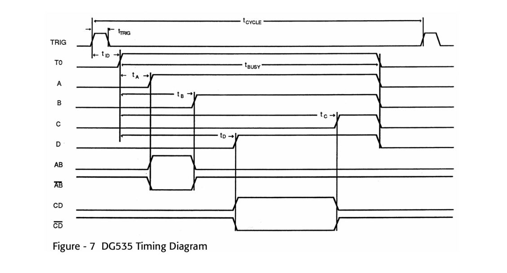
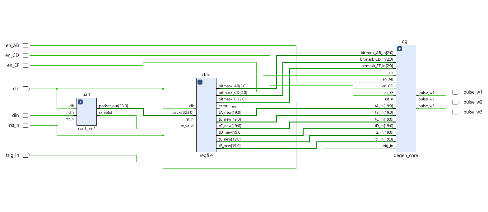

# degen

`degen` is FPGA-based programmable delay/pulse generator (hence the name `degen`) **for a photoacoustic imaging, synchronized to a portable ultrasound system's trigger signal**. Generates _three independently-timed pulse outputs per trigger_ (can effectively select between two or three), driving separate external channels, _with register configuration over UART_ from the portable ultrasound system. ***Based on the DG535 digital pulse generator***

## Motivation
I'm building this to a). **_greatly reduce the hardware footprint for a research project_** and b). _to increase my understading of different types of hardware and how they work at a fundamental level_. **I can strongly say** that my RTL skills, testbench writing, and systems thinking became ***much stronger*** in the 2 weeks that I spent building this.

## Timing Scheme

_DG535 timing diagram (as obviously stated in image)_

***The timing scheme of `degen` is based on the DG535 timing diagram***, which has **4 configuration channels** (tA, tB, tC, tD) and **2 generated pulses (tAB, tCD)**. _tAB asserts between tA and tB firing_; _tCD asserts between tC and tD_.

***Triggers aren't always meant to fire on every channel***; AB needs to fire on even triggers and CD on odd ones, or a channel needs to skip triggers entirely if its own cycle time runs longer than the trigger period allows. Rather than hardcoding that alternation, **each channel gets a small bitmask and a rotating pointer**: on every trigger, **the pointer advances through the mask, and the channel only actually fires when the current bit is set**. A simple even/odd split is just a 2-bit mask (`01`/`10`); a channel that needs to skip two out of every three triggers is just a wider mask with more zeros. (This also turned out to be the cleaner fix for the original DG535-style problem, as a channel whose `t_cycle` runs longer than the raw trigger period doesn't need faster hardware, it just needs a mask that skips enough triggers to give itself room to finish.)

**All delay values are in clock ticks, not real time, because they scale with FPGA clock frequency.** For a 10 µs pulse starting immediately on trigger: tA = 0 regardless of clock speed, but tB = 1000 at 100 MHz vs. tB = 500 at 50 MHz.

I first tried a fixed pulse-width architecture (hardcoding pulse width directly), but that made timing ambiguous, as you'd need to specify both when tA fires *and* the pulse width separately, which is redundant and rigid. So, for simplicity, I mimicked the DG535's start/stop pair approach, which worked out well long-term.

## Architecture

_Vivado-generated RTL Linter Schematic_

Some terms for understanding:
- `Delay`: the selected t_delay (corresponds to tA, tB, tC, tD, tE, and tF) 
- `Pulse`: the generated pulse from the delay information (tAB, tCD, tEF)
- `Bitmask`: the bitmask needed for a specific pulse (AB, CD, EF); see above for the explanation

***The overall flow of the device is the following:***
- User programs delays in real time with a Python script (API in `py2degen`)
- A 24-bit packet with the selected _delay_ information OR a bitmask for a selected _pulse_ is **sent over UART** from the ultrasound system **using a USB-TTL adapter** (_this is currently under test_)
- The FPGA decodes the packet and stores bitmask or delay information in the register file
- Upon the next clock cycle, `degen_core` (the core timing logic in the RTL) updates state with the new information in the register file

## Packet Encoding

Configuration data arrives as a 24-bit packet (over SPI or UART) and is decoded by `regfile`. Bit `[20]` acts as the mode select, splitting the packet into two layouts:

### Delay/timing packet (`packet[20] = 0`)

```
+----------+----+----------------------+
| REG_SEL  | EN |   TIMING DATA (20b)  |
+----------+----+----------------------+
  [23:21]    [20]        [19:0]
```

| Field | Bits | Meaning |
|---|---|---|
| `REG_SEL` | `[23:21]` | Which delay register this packet writes to |
| Mode bit | `[20]` | `0` → this is a delay/timing packet |
| `TIMING DATA` | `[19:0]` | The actual delay value (clock ticks) written into the selected register |

`REG_SEL` encoding:

| `REG_SEL` (`packet[23:21]`) | Register |
|---|---|
| `000` | `tA` |
| `001` | `tB` |
| `010` | `tC` |
| `011` | `tD` |
| `100` | `tE` |
| `101` | `tF` |

### Bitmask packet (`packet[20] = 1`)

```
+----------+----+------------+--------+
| PULSE_SEL| EN |  (unused)  |BITMASK |
+----------+----+------------+--------+
  [23:21]    [20]   [19:3]     [2:0]
```

| Field | Bits | Meaning |
|---|---|---|
| `PULSE_SEL` | `[23:21]` | Which pulse channel's trigger-acceptance pattern this packet configures |
| Mode bit | `[20]` | `1` → this is a bitmask configuration packet |
| `[19:3]` | — | Unused/reserved |
| `BITMASK` | `[2:0]` | The 3-bit trigger-acceptance pattern written for the selected channel |

`PULSE_SEL` encoding (one-hot):

| `PULSE_SEL` (`packet[23:21]`) | Channel |
|---|---|
| `001` | AB (`bitmask_AB`) |
| `010` | CD (`bitmask_CD`) |
| `100` | EF (`bitmask_EF`) |

### Worked examples

| Packet (hex) | Mode | Decode |
|---|---|---|
| `0x2001F4` | Delay | `REG_SEL=001` (tB), `EN=0`, data = `0x001F4` = 500 → `tB = 500` |
| `0x300004` | Bitmask | `PULSE_SEL=001` (AB), `EN=1`, `BITMASK=100` → AB accepts every 3rd trigger |
| `0x500002` | Bitmask | `PULSE_SEL=010` (CD), `EN=1`, `BITMASK=010` → CD accepts trigger index 1 of the pattern |

What you should basically take away from this is that ***the highest 4 bits of the packet are the most important*** due to their configuration nature, as without them, any operation would effectively be useless. 

## API
I used `Python` to write a small library called `Degen`, which makes encoding and sending delays extremely simple.
- Contains a `Pulse` and `Bitmask` class to generate delays and bitmasks from a dictionary input with all of the necessary information.
- Sends data to the FPGA using `pyserial`

```python
# Adapted from py2degen/tests/test.py

from Degen import Pulse, Bitmask

BAUD_RATE = 115200

p1 = {
    "t1": 0,
    "t2": 10e-6,
    "tX_sel": "tF",
    "F_clk": 50_000_000,
    "T_trig": 500
}

b1 = {
    "pulse_sel": "tAB",
    "bitmask": 0b100
}

p = Pulse(p1)
p.write('t1', 'COM5', BAUD_RATE)   # automatically converts packet to bytes and sends over UART

b = Bitmask(b1)
b.write('COM5', BAUD_RATE)    # automatically converts packet to bytes and sends over UART
```

## FPGA vs. MCU in this case
This task can easily be done using a standard MCU, like an STM32 or an Arduino, but, _in this case_, **using an FPGA guarantees minimal jitter** (on the order of picoseconds) vs MCUs (which can range up to high microseconds territory if using software interrupts). _(That being said, a bare-metal implementation of the interrupts in software would suffice and be much easier to program and maintain.)_

But the main motivator was that I thought it would be cooler to implement it on an FPGA. When I first got to work with the DG535, the first thought I had was to replicate this using an FPGA, so here we are!

### FPGA of choice
I used a `Terasic DE0-Nano` for this project; however, I used Vivado for all of the development due to my familiarity with the technologies. Intel Quartus was used to program the FPGA since it's technically still an Intel FPGA.

## Repository Structure
- `src/`: contains RTL, testbenches, and constraints
- `py2degen/`: contains the Python API (`Degen`) to send delay and bitmask configurations over UART to the FPGA
- `imgs`: contains images used in this repo (DG535 timing diagram, RTL schematic, and **final top module waveform**)

## Last few steps
- Write final pin assignments (the constraints in `src` are testing assignments to validate behavior)
- Possibly implement a phase-locked loop (PLL) to minimize jitter